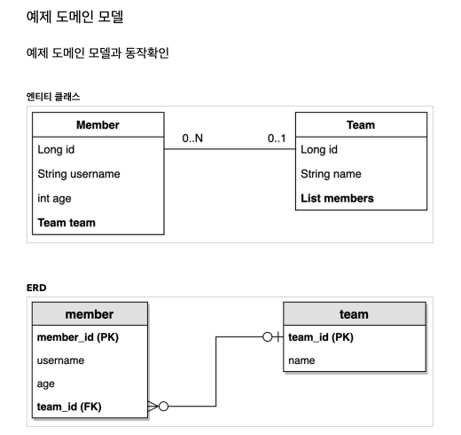

#  예제 도메인 구성



## **Member** 엔티티
```java
Entity
@Getter @Setter
@RequiredArgsConstructor
@NoArgsConstructor(access = AccessLevel.PROTECTED)
@ToString(of = {"id", "userName", "age"})
public class Member {
    
    @Id @GeneratedValue
    @Column(name = "MEMBER_ID")
    private Long id;
    
    @NonNull
    private String userName;
    private int age;
    
    @ManyToOne(fetch = FetchType.LAZY)
    @JoinColumn(name = "TEAM_ID")
    private Team team;
    
    public Member(String userName, int age, Team team) {
        this.userName = userName;
        this.age = age;
        if (!Objects.isNull(team)) {
            changeTeam(team);
        }
    }
    
    /**
     * 연관관계 편의 메서드
     */
    public void changeTeam(Team team) {
        this.team = team;
        if (!Objects.isNull(id)) {
            team.getMembers().removeIf(m -> m.getId().equals(id)); 
        }
        team.getMembers().add(this);
    }
}
```
## **Team** 엔티티
```java
@Entity
@RequiredArgsConstructor
@NoArgsConstructor(access = AccessLevel.PROTECTED)
public class Team {
    
    @Id @GeneratedValue
    @Column(name = "TEAM_ID")
    private Long id;
    
    @NonNull
    @Getter
    private String name;
    
    @Getter
    @OneToMany(mappedBy = "team", cascade = CascadeType.ALL)
    private List<Member> members = new ArrayList<>();
}
```